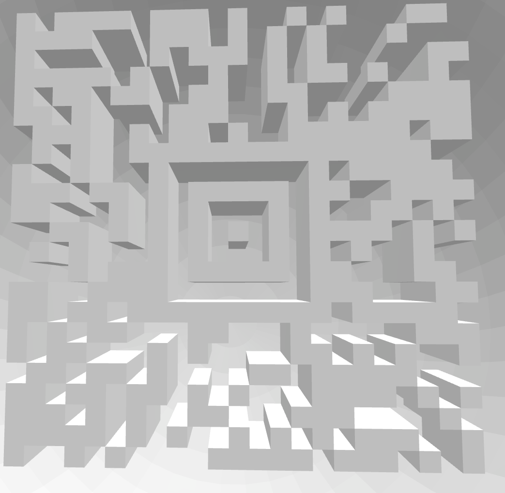

## HV19.02 Triangulation

Today we give away decorations for your Christmas tree. But be careful and do not break it.

[HV19.02-Triangulation.zip](./a5f47ab8-f151-4741-b061-d2ab331bf641.zip)

### Solution 

The zip contains a 3D plan (.stl file) of a christmas ball. Using any STL viewer (e.g. [FreeCAD](https://www.freecadweb.org/)), we can open the model. Once, we zoom into the inner part of it, we can see a QR code: 

Unfortunately, due to the poor contrast and the 3D-effects, my QR code scanner was not able to read the code, so I decided to quickly recreate the pattern in photoshop (I know, manual work sucks, but it works :) ).

**Flag:** HV19{Cr4ck_Th3_B411!}