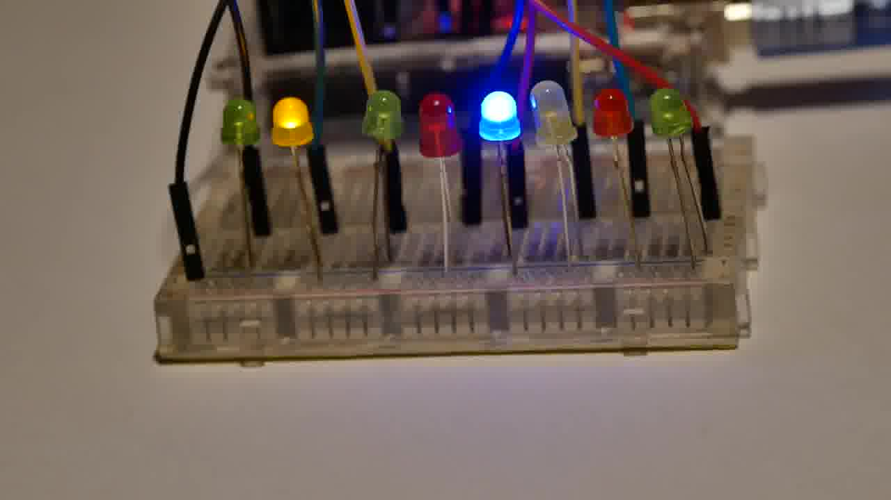

## HV19.07 Santa Rider

Santa is prototyping a new gadget for his sledge. Unfortunately it still has some glitches, but look for yourself.

For easy download, get it here: [HV19-SantaRider.zip](./3dbe0c12-d794-4f79-ae67-09ac27bd099d.zip)

### Solution
When looking at the middle of the video, we can see that the LEDs start to wildly blink instead of continuing the pattern from the beginning/end. Also, there are exactly 8 LEDs, which could represent eight bits. I stopped the video at the beginning (see photo) and realized that those are indeed the bits of an H.



Using the following `ffmpeg` command, I extracted all video frames and manually converted the blinking LEDs to bits:

`ffmpeg -i .\3DULK2N7DcpXFg8qGo9Z9qEQqvaEDpUCBB1v.mp4 image-%d.jpeg`

After a lot of swearing I ended up with the following bit sequence, which can be converted to the flag:

```
01001000 01010110 00110001 00111001 01111011 00110001 01101101 01011111 01100001 01101100 01110011 00110000 01011111 01110111 00110000 01110010 01101011 00110001 01101110 01100111 01011111 00110000 01101110 01011111 01100001 01011111 01110010 00110011 01101101 00110000 01110100 00110011 01011111 01100011 00110000 01101110 01110100 01110010 00110000 01101100 01111101
```

**Flag:**  HV19{1m_als0_w0rk1ng_0n_a_r3m0t3_c0ntr0l}
