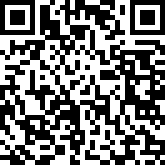

## HV19.09 Santas Quick Response 3.0

Visiting the following railway station has left lasting memories.


Santas brand new gifts distribution system is heavily inspired by it. Here is your personal gift, can you extract the destination path of it?



### Solution

Googling the first image directs us to Wolframs [Rule 30](http://mathworld.wolfram.com/Rule30.html). This is a special form of a cellular automata. My first guess was that I need to apply this evolution rule on the invalid QR code. I created a small script with Node, but this didn't work.

After wasting a lot of time on this idea, I decided that it's time to try something else. Some parts of the QR code already seem valid, so maybe we only need to change parts of it. When we look at the evolution pattern of rule 30, we see that it forms some sort of pyramid. So why not try to XOR it with our QR code. I updated my node script to calculate the pattern of rule 30 and XORed it with the input image, using various shifts. I also added a QR-code scanning library, to automate the detection step. Running the [program](./crack.js), results in the following output:

```
Got flag: HV19{Cha0tic_yet-0rdered} - Start Index was 16
```

**Flag:** HV19{Cha0tic_yet-0rdered}
