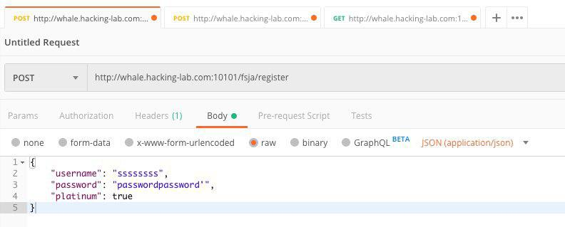
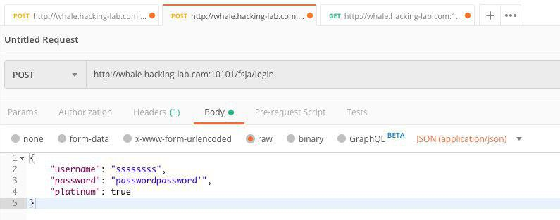
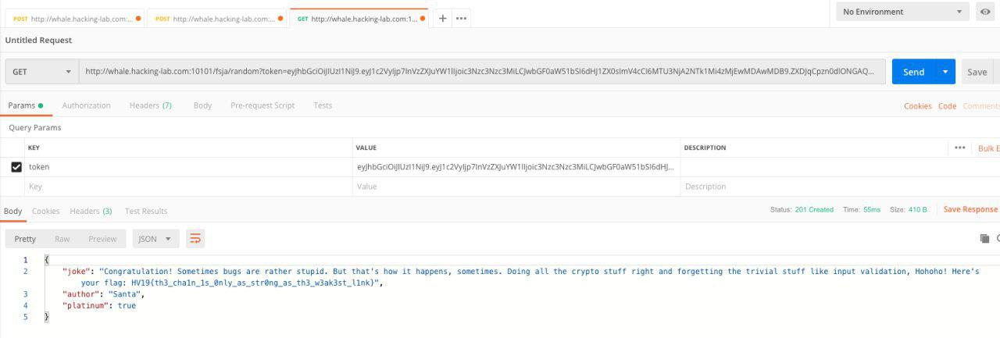

## HV19.11 Frolicsome Santa Jokes API

The elves created an API where you get random jokes about santa.

### Resources

Go and try it here: [http://whale.hacking-lab.com:10101](http://whale.hacking-lab.com:10101)

### Solution

For this challenge, we get a simple REST API, which allows us to register, login and get random jokes (authenticated users only). The authentication is performed using JSON Web Tokens (JWT). My first guess was to try some common attacks like SQL injection but nothing was successful. I took a closer look at the content of the token, which looks as follows:

```json
{
  "user": {
    "username": "testuser",
    "platinum": false
  },
  "exp": 1576086018.984
}
```

The platinum flag looks very suspicious, so why not try to create a new user and try to set this flag to `true` during registration.



Now let's login:



And request a random token:



**Flag:** HV19{th3_cha1n_1s_0nly_as_str0ng_as_th3_w3ak3st_l1nk}
