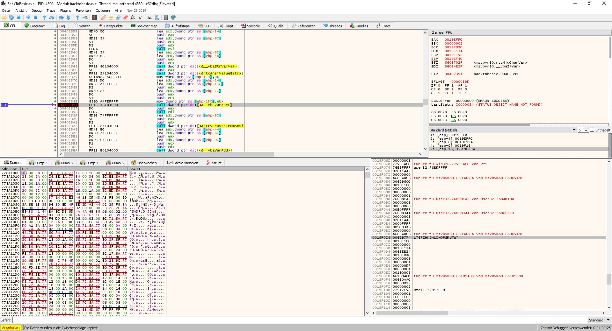
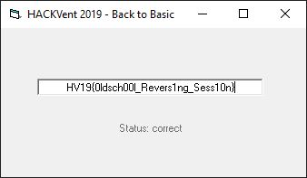
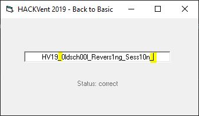

## HV19.12 back to basic

Santa used his time machine to get a present from the past. get your rusty tools out of your cellar and solve this one!

### Resources

[HV19.12-BackToBasic.zip](./67e6c6c2-1119-4c1e-a9b5-85f118173a40.zip)

### Solution

For this challenge, we get an old school Visual Basic binary. My first thought was that this should be easy, because VB is similar to C#, which can be simply decompiled using public tools. However, it turns out that this is not as easy for old VB binaries (although they work quite similar). After trying a couple of (freemium) VB decompilers, I decided to switch back to good old IDA.

After a while of reversing, I found the function which reacts to changes of the text in the input field (starting at `0x401F80`). It then performs a 3-step check, to validate the flag. The first check is to verify the flag format, checking for it to start with `HV19`. Then it also compares the length of the input, which needs to be 33. Finally, it loops through the characters of the flag content (starting from index `6`) and xor's them. The result of this operation, gets compared to the string `6klzic<=bPBtdvff'yFI~on//N`. If the values match, the input was correct.

However, using only static analysis I was not really able to grasp how this loop calculates the encrypted flag, so I decided to debug the program using x32dbg. By setting a breakpoint at the `xor` instruction (at `0x402391`) and examining the values on the stack, I found out that the encryption simply xor's each character with it's index:

Using this information, I wrote a small [python script](./crack.py), which calculates the flag:

**Flag:** HV19{0ldsch00l_Revers1ng_Sess10n}

#### Fun Fact

The validatino step complete ignores the curly braces around the flag content, so the program also accepts any other character in these positions:

