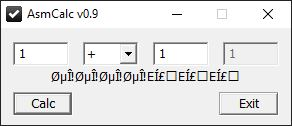

## HV19.16 B0rked Calculator

Santa has coded a simple project for you, but sadly he removed all the operations.
But when you restore them it will print the flag!

### Resources

[HV19.16-b0rked.zip](./9b90c573-d530-401b-b3f8-24454bbf015e.zip)

### Solution

For this challenge, we get a PE32 executable. The exe is a simple calculator program, which allows us to do the 4 basic arithmetic operations (add, subtract, multiply, divide). However, none of the operations works as expected. Moreover, we see that the calculator outputs some weird characters after we do a simple calculation: 

As the challenge description already mentions, the operations have been removed. Probably, if we successfully readd them, this line will contain the flag. I opened the application in IDA and was quickly able to find the stub-functions for the required operations:

- add: `0x4015B6`
- subtract: `0x4015C4`
- multiply: `0x4015D4`
- divide: `0x4015E4` 

However, the content of this functions was completely nop-ed out. Time to dig out some basic assembly knowledge and restore the correct instructions! By applying the following patches, I was able to recover the functionality of the calculator:

The final assembly looks as follows:

When looking at the xrefs of these functions, we see that they are not only used to calculate the equations entered by the user, but also in some other function (`0x401519`). This function is used when calculating the flag. If we start the patched executable and do some simple calculation, we are able to get the flag:

**Flag:** HV19{B0rked_Flag_Calculat0r}
