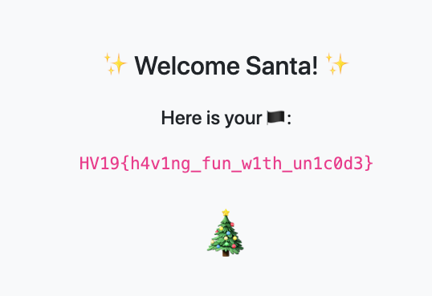

## HV19.17 Unicode Portal

Buy your special gifts online, but for the ultimative gift you have to become admin.

### Resources

[http://whale.hacking-lab.com:8881/](http://whale.hacking-lab.com:8881/)

### Solution

For this challenge, we get access to a website. After registration and log in, we are able to see a page presenting various christmas-themed unicode emojis. Moreover, we are able to take a look at parts of the websites [source code](./user.php). Finally, there is an admin section, to which we do not have access. From the `isAdmin` check in the source code, we can deduct that we need to log in as user santa to access this part of the page, which most likely contains the flag.

Of course, creating a user named santa fails, because it already exists. So let's dig a bit deeper into the provided code. One thing that quickly caught my attention is, that the sql queries (more particular the username comparison) for checking whether a user already exists, and doing a log in differ:

- The `isUsernameAvailable` function compares the username using the `BINARY` (exact case sensitive match) keyword:
  - `... WHERE LOWER(username) = BINARY LOWER('".$usr."')`
- The `verifyCreds` function compares them using a simple assertion 
  - `... WHERE username='".$usr."'"`

Moreover, the SQL statement in the `registerUser` function contains a very interesting clause (`... ON DUPLICATE KEY UPDATE password='".$pwd."'`). By combining all these findings, I came to the conclusion that it should be possible to register a user with a name that is not equal to `santa` using exact case sensitive matching (via `BINARY` keyword), but equal to `santa` using a simple comparison (`=` operator). In this case, the `ON DUPLICATE KEY` trigger would overwrite the password of the `santa` user, allowing me to log in and get the flag. 

A quick google search revealed that this should be easily possible by using characters with accent (e.g. german a Umlaut-A) in `santa` (see this [StackOverflow Post](https://stackoverflow.com/questions/5629111/how-can-i-make-sql-case-sensitive-string-comparison-on-mysql)). By registering a user named `sànta`, I was able to set the admin password. Afterwards, I was able to log in as `santa` and get the flag.

As any other hacker could overwrite the password in the meantime, it is important to quickly obtain the flag. :) 

**Flag:** HV19{h4v1ng_fun_w1th_un1c0d3}