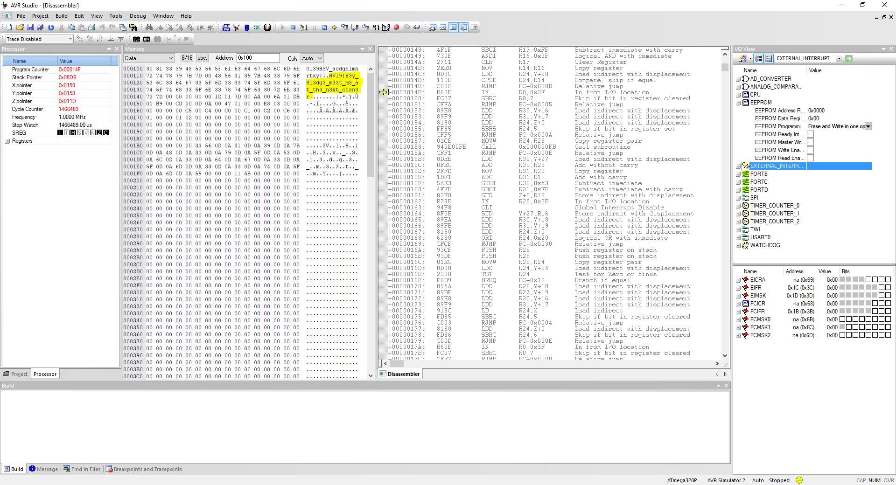

## HV19.22 The command ... is lost

Santa bought this gadget when it was released in 2010. He did his own DYI project to control his sledge by serial communication over IR. Unfortunately Santa lost the source code for it and doesn't remember the command needed to send to the sledge. The only thing left is this file: [thecommand7.data](./a97ef12f-c583-4c54-84e4-68eaa2737bd9.data)

Santa likes to start a new DYI project with more commands in January, but first he needs to know the old command. So, now it's on you to help out Santa.

### Solution

For this challenge, we get a hex-dump of an Arduino program. As I am not too familiar with the process of reversing Arduino roms, my first approach was to emulate it in AVR Studio. As santas gadget was released in 2010, my first guess for the MCU was ATMega328p, which worked out pretty well. I left the program running for several seconds, and then simply paused it. I opened the subview for inspecting different memory locations, and to my surprise, I simply found the flag on the stack:

Still, I wanted to get some sort of idea what is going on. Therefore, I reconfigured my IDA to handle the Arduino MCU and loaded the hex file. Starting from `0x2be`, there are four functions which load certain characters from a predefined set (flag characters, stored in the data section) and stores them in some other location. These sequences of `lds` and `sts` instructions seem to build the flag-string, which I found on the stack by emulating the program.

**Flag:** HV19{H3y_Sl3dg3_m33t_m3_at_th3_n3xt_c0rn3r}