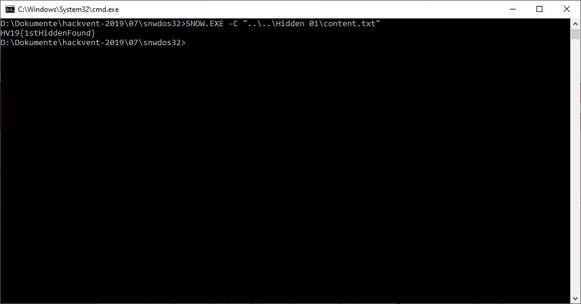

## HV19.H1 Hidden One

Sometimes, there are hidden flags. Got your first?

### Solution

The first hidden flag was released along day #6, so it is highly likely that it's hidden within this challenge. Something that quickly caught my attention was the
strange text on the bottom of the challenge description:

```
Born: January 22
Died: April 9
Mother: Lady Anne
Father: Sir Nicholas
Secrets: unknown
```

After taking a closer look, I saw that each line contains a series of trailing whitespaces (tabs and spaces). Maybe this is some sort of whitespace steganography. A quick Google search directed me to the tool [Snow](http://www.darkside.com.au/snow/). With the help of this program, I was able to retrieve the flag:



**Flag:** HV19{1stHiddenFound}
